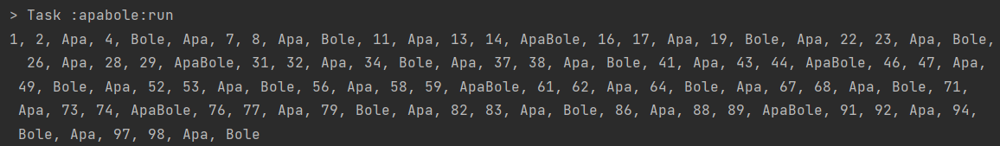
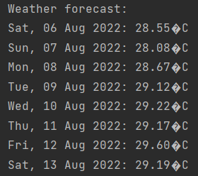

Minitest when I was applying a job at [PT Stampindo Lancar Jaya](https://glints.com/id/companies/pt-stampindo-lancar-jaya/1807da03-7a80-4613-8013-47cc89cb7966)

Problem given:

1. Create a fizzbuzz-like program
2. Consume a weather API

## Run Instructions

To run apabole project

```
gradlew run -p apabole
```

To run weather project

```
gradlew run -p weather
```

## Example Output

Apabole



Weather


